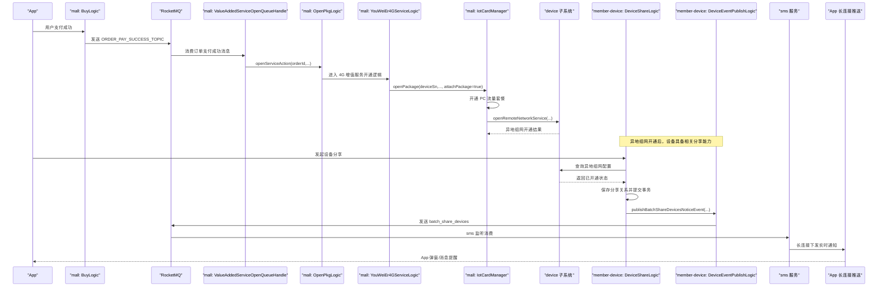

```mermaid
sequenceDiagram
    participant App as "App"
    participant MallPay as "mall: BuyLogic"
    participant MQ as "RocketMQ"
    participant MallOpen as "mall: ValueAddedServiceOpenQueueHandle"
    participant OpenPkg as "mall: OpenPkgLogic"
    participant VA4G as "mall: YouWeiEr4GServiceLogic"
    participant IotMgr as "mall: IotCardManager"
    participant DeviceSvc as "device 子系统"
    participant MemberDevice as "member-device: DeviceShareLogic"
    participant EventPub as "member-device: DeviceEventPublishLogic"
    participant SMS as "sms 服务"
    participant Push as "App 长连接推送"

    App->>MallPay: 用户支付成功
    MallPay->>MQ: 发送 ORDER_PAY_SUCCESS_TOPIC
    MQ->>MallOpen: 消费订单支付成功消息
    MallOpen->>OpenPkg: openServiceAction(orderId,...)
    OpenPkg->>VA4G: 进入 4G 增值服务开通逻辑
    VA4G->>IotMgr: openPackage(deviceSn,..., attachPackage=true)
    IotMgr->>IotMgr: 开通 PC 流量套餐
    IotMgr->>DeviceSvc: openRemoteNetworkService(...)
    DeviceSvc-->>IotMgr: 异地组网开通结果

    Note over MemberDevice,EventPub: 异地组网开通后，设备具备相关分享能力

    App->>MemberDevice: 发起设备分享
    MemberDevice->>DeviceSvc: 查询异地组网配置
    DeviceSvc-->>MemberDevice: 返回已开通状态
    MemberDevice->>MemberDevice: 保存分享关系并提交事务
    MemberDevice->>EventPub: publishBatchShareDevicesNoticeEvent(...)
    EventPub->>MQ: 发送 batch_share_devices
    MQ->>SMS: sms 监听消费
    SMS->>Push: 长连接下发实时通知
    Push-->>App: App 弹窗/消息提醒

```