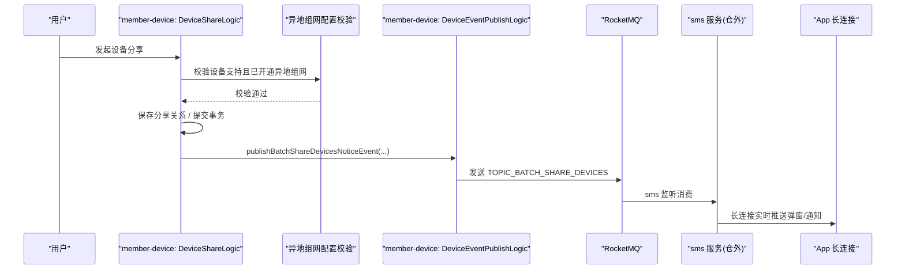

```mermaid
sequenceDiagram
    participant User as "用户"
    participant MemberDevice as "member-device: DeviceShareLogic"
    participant DeviceCheck as "异地组网配置校验"
    participant EventPub as "member-device: DeviceEventPublishLogic"
    participant MQ as "RocketMQ"
    participant Sms as "sms 服务(仓外)"
    participant App as "App 长连接"

    User->>MemberDevice: 发起设备分享
    MemberDevice->>DeviceCheck: 校验设备支持且已开通异地组网
    DeviceCheck-->>MemberDevice: 校验通过
    MemberDevice->>MemberDevice: 保存分享关系 / 提交事务
    MemberDevice->>EventPub: publishBatchShareDevicesNoticeEvent(...)
    EventPub->>MQ: 发送 TOPIC_BATCH_SHARE_DEVICES
    MQ->>Sms: sms 监听消费
    Sms->>App: 长连接实时推送弹窗/通知

```