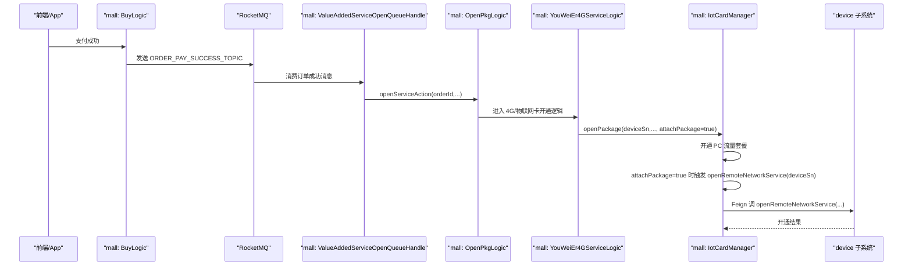

```mermaid
sequenceDiagram
    participant App as "前端/App"
    participant MallPay as "mall: BuyLogic"
    participant MQ as "RocketMQ"
    participant MallOpen as "mall: ValueAddedServiceOpenQueueHandle"
    participant OpenPkg as "mall: OpenPkgLogic"
    participant VA4G as "mall: YouWeiEr4GServiceLogic"
    participant IotMgr as "mall: IotCardManager"
    participant DeviceSvc as "device 子系统"

    App->>MallPay: 支付成功
    MallPay->>MQ: 发送 ORDER_PAY_SUCCESS_TOPIC
    MQ->>MallOpen: 消费订单成功消息
    MallOpen->>OpenPkg: openServiceAction(orderId,...)
    OpenPkg->>VA4G: 进入 4G/物联网卡开通逻辑
    VA4G->>IotMgr: openPackage(deviceSn,..., attachPackage=true)
    IotMgr->>IotMgr: 开通 PC 流量套餐
    IotMgr->>IotMgr: attachPackage=true 时触发 openRemoteNetworkService(deviceSn)
    IotMgr->>DeviceSvc: Feign 调 openRemoteNetworkService(...)
    DeviceSvc-->>IotMgr: 开通结果

```